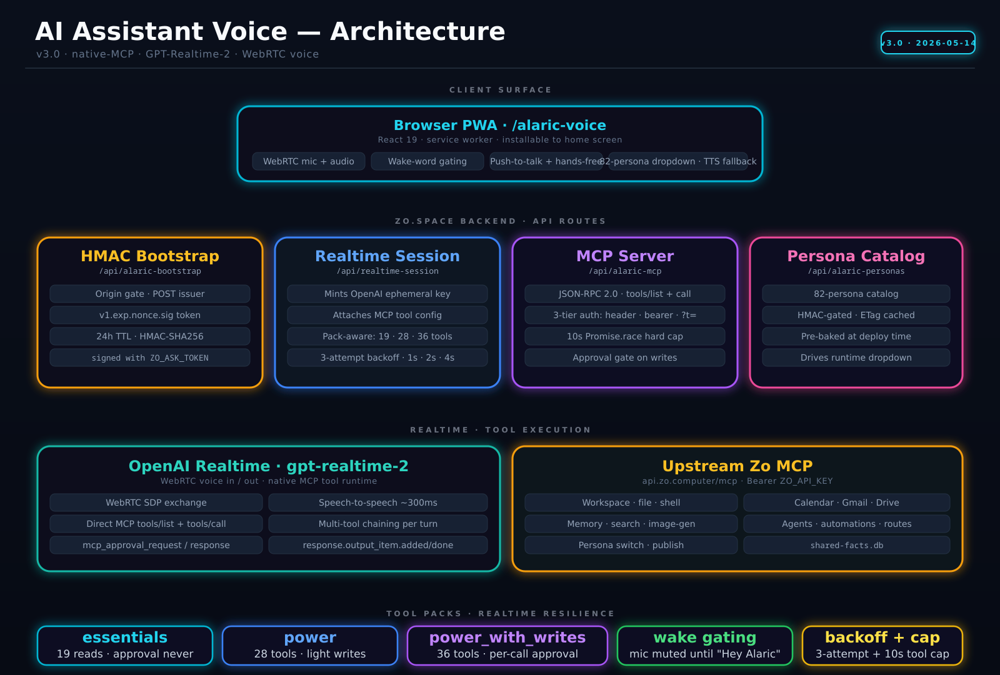

# AI Assistant Voice

A voice interface for [Zo Computer](https://zo.computer) personas using **OpenAI Realtime API (GA, `gpt-realtime-2`)** with native MCP tool integration. Speak to any persona, hear it speak back, and let it call your Zo tools directly — all keys stay server-side.

Built as a Progressive Web App (PWA) deployed to your `zo.space`. Works with any of your Zo personas — pick from the dropdown at runtime.

---

## Architecture



End-to-end flow:

1. **Bootstrap** — PWA POSTs to `/api/alaric-bootstrap`; gets a 24h HMAC session token (`v1.exp.nonce.sig`) signed with `ZO_ASK_TOKEN`.
2. **Mint session** — PWA POSTs to `/api/realtime-session` with the token + tool pack choice. Server mints an ephemeral OpenAI client secret and attaches the MCP tool config (`server_url`, `allowed_tools`, `require_approval`).
3. **WebRTC** — PWA opens a Realtime WebRTC session with OpenAI using the ephemeral key. Voice in/out streams over the data channel.
4. **MCP tool calls** — OpenAI Realtime backend hits `/api/alaric-mcp?t=ALARIC_MCP_TOKEN` directly (no browser hop). The MCP server dispatches to handlers, which call `api.zo.computer/mcp` upstream with `Bearer ZO_API_KEY`.
5. **Personas** — `/api/alaric-personas` returns the 82-persona catalog (HMAC-authed, ETag-cached) for the dropdown.

### Tool packs

| Pack | Tools | `require_approval` |
|------|-------|--------------------|
| `essentials` | 19 — memory, calendar read, email/SMS send, file read, web search | `never` |
| `power` | 28 — adds image search/gen, transcription, Gmail, calendar create | `never` |
| `power_with_writes` | 36 — adds agent/automation/route writes, persona switch, publish | per-tool: writes `always`, reads `never` |

---

## Routes deployed by `deploy-tts-endpoint.ts --deploy-all`

| Route | Type | Purpose |
|-------|------|---------|
| `/api/tts` | api | TTS proxy (ElevenLabs / OpenAI / edge-tts backends) |
| `/api/alaric-ask` | api | Text-mode Zo Ask proxy (fallback for non-Realtime mode) |
| `/api/alaric-bootstrap` | api | HMAC session token issuer (24h TTL) |
| `/api/realtime-session` | api | OpenAI Realtime session mint + MCP tool config |
| `/api/alaric-mcp` | api | JSON-RPC 2.0 MCP server, 36 tools, 3-tier auth |
| `/api/alaric-personas` | api | 82-persona catalog (HMAC + ETag) |
| `/alaric-voice` | page | The React PWA |
| `/alaric-voice/manifest` | api | PWA install manifest |
| `/alaric-voice/sw` | api | Service worker (offline shell) |

---

## Requirements

- A [Zo Computer](https://zo.computer) account
- [Bun](https://bun.sh) runtime (pre-installed on Zo)
- Zo Secrets (Settings → Advanced → Secrets):
  - `ZO_ASK_TOKEN` — HMAC secret + Zo Ask proxy auth
  - `ZO_API_KEY` — used by `/api/alaric-mcp` to call upstream Zo MCP
  - `ALARIC_MCP_TOKEN` — shared secret for OpenAI Realtime → MCP (`openssl rand -hex 32`)
  - `OPENAI_API_KEY` — for Realtime sessions + OpenAI TTS backend
  - `ELEVENLABS_API_KEY` — only if using ElevenLabs TTS backend (optional)

---

## Installation

### 1. Clone

```bash
git clone https://github.com/marlandoj/ai-assistant-voice.git \
  /home/workspace/Skills/ai-assistant-voice
```

Or, in natural language to your Zo: *"Install the ai-assistant-voice skill from GitHub and set it up."*

### 2. Set secrets

In Zo Computer → Settings → Advanced → Secrets:
- Create an access token, save it as `ZO_ASK_TOKEN`
- Save your `ZO_API_KEY`, `OPENAI_API_KEY`
- Generate `ALARIC_MCP_TOKEN`: `openssl rand -hex 32`

### 3. Deploy

```bash
bun /home/workspace/Skills/ai-assistant-voice/scripts/deploy-tts-endpoint.ts --deploy-all
```

Default backend is ElevenLabs. Use `--backend openai` or `--backend edge` to switch.

### 4. Open the PWA

Visit `https://yourhandle.zo.space/alaric-voice` (sign in to view — private by default). Pick a persona from the dropdown, tap the mic, talk.

### 5. Install to phone (optional)

Open in Chrome/Safari on mobile → "Add to Home Screen." Launches full-screen with offline shell.

---

## TTS backend comparison

| Backend | Voice quality | Cost | API key |
|---------|--------------|------|---------|
| ⭐ ElevenLabs | Best — natural, expressive | ~$0.30 / 1K chars | `ELEVENLABS_API_KEY` |
| OpenAI TTS | Very good — 6 voices | ~$0.015 / 1K chars | `OPENAI_API_KEY` |
| edge-tts | Good — 300+ neural voices | Free | none |
| Browser SpeechSynthesis | Basic | Free | none (fallback) |

In **Realtime mode** (default), OpenAI handles audio synthesis directly via WebRTC — the `/api/tts` proxy is only used in text-mode fallback or for the v1 vanilla shell at `pwa/`.

---

## Repository layout

```
Skills/ai-assistant-voice/
├── assets/
│   ├── alaric-bootstrap-route.ts     # HMAC token issuer
│   ├── alaric-mcp-route.ts           # JSON-RPC MCP server, 36 tools
│   ├── alaric-personas-route.ts      # 82-persona catalog
│   ├── ai-ask-route.ts               # Text-mode Zo Ask proxy
│   ├── realtime-session-route.ts     # OpenAI Realtime mint
│   ├── pwa-page.tsx                  # React PWA (placeholderized)
│   ├── manifest-route.ts             # PWA manifest
│   ├── sw-route.ts                   # Service worker
│   ├── tts-route.ts                  # ElevenLabs TTS
│   ├── tts-route-openai.ts           # OpenAI TTS
│   ├── tts-route-edge.ts             # edge-tts
│   └── zo-ask-route.ts               # Legacy (used by v1 vanilla pwa/)
├── scripts/
│   ├── deploy-tts-endpoint.ts        # Deploys all routes
│   ├── ai-assistant-voice.ts         # CLI: voice configs, TTS test
│   └── setup-edge-tts.sh             # One-time edge-tts install
├── pwa/                              # v1 vanilla JS shell (legacy)
└── docs/
    ├── alaric-voice-v3-architecture.png
    └── alaric-voice-v3-architecture.svg
```

---

## CLI

```bash
cd /home/workspace/Skills/ai-assistant-voice/scripts

bun ai-assistant-voice.ts voices                    # List ElevenLabs voices
bun ai-assistant-voice.ts config set \
  --persona <persona-id> --name "Alaric" --voice ErXwobaYiN019PkySvjV
bun ai-assistant-voice.ts config list
bun ai-assistant-voice.ts speak "Hello, Sir." --voice ErXwobaYiN019PkySvjV
```

Configs at `~/.zo/voice/persona-voices.json`.

---

## Customizing the assistant image

Default avatar is a holographic AI face at `/images/ai-assistant-portrait.png`. To replace:

Ask Zo: *"Change the AI assistant avatar to [description]"* — it'll generate and upload.

Or manually: replace the asset at `/images/ai-assistant-portrait.png` on your zo.space.

The image is displayed as a 260×260 circle with an animated glow when speaking.

---

## Deploying to a different host or assistant identity

```bash
bun /home/workspace/Skills/ai-assistant-voice/scripts/deploy-tts-endpoint.ts \
  --deploy-all \
  --host yourhandle.zo.space \
  --name "Nova" \
  --persona <persona-uuid>
```

Placeholders in `pwa-page.tsx`, `manifest-route.ts`, `sw-route.ts` (`{{ASSISTANT_NAME}}`, `{{ASSISTANT_SLUG}}`, `{{PAGE_PATH}}`, `{{PORTRAIT_PATH}}`, `{{ZO_HOST}}`, `{{DEFAULT_PERSONA_ID}}`, `{{PERSONAS_JSON}}`) are substituted at deploy time.

---

## License

MIT
